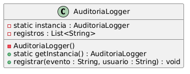
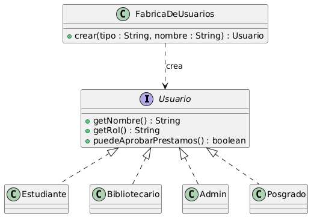
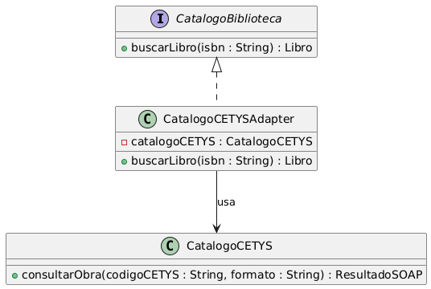
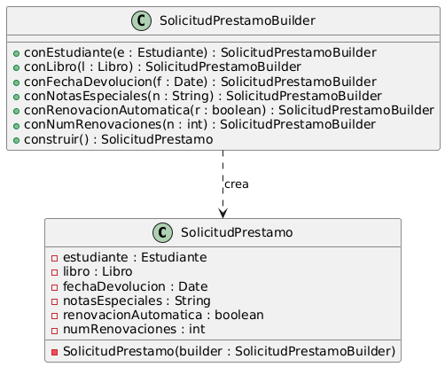

Seccion 2:

Esta es la segunda sección del examen con las partes de código:
Pregunta 2A:
Lo primero que hice fue poner el constructor como private. Ya con eso no deberia ser posible que alguien escriba new AuditoriaLogger() desde fuera de la clase. Para obtener una instancia es a través del método estático getInstancia(), que revisa si ya existe una y, si no, la crea. Lo de synchronized es lo que creo que comento por si dos hilos intentan obtenerla al mismo tiempo no se terminen creando dos por accidente.
El problema concreto que resuelve esto es el requisito de tener un único registro de auditoría centralizado. Si se tuvieran dos instancias corriendo a la vez, cada una guardaría una parte de los eventos del sistema, y al final el log estaría partido en dos. Y pues ya con el Singleton toda acción que pase por el sistema, sin importar de donde venga, escriba en el mismo lugar.
(Uso los diagramas en PlantUML por que es el que sale para tenerlo en web entonces se ven un poco feos por eso)

[AuditoriaLogger Código](./Codigos/AuditoriaLogger.java)

Pregunta 2B:
Para agregar un nuevo tipo de usuario, lo único que tendría que hacer es crear una nueva clase Posgrado que implemente la interfaz Usuario, y registrarla en la fábrica como un caso más. El código cliente que llama a fabrica.crear("POSGRADO", "Juan") no se entera de cómo se construye, solo recibe un Usuario y lo usa con los métodos. Las clases Estudiante, Bibliotecario y Admin no se tocan, y los lugares del sistema que ya usaban usuarios siguen funcionando igual.
El principio SOLID que se usa es el Open/Closed Principle, que dice que las clases deben estar abiertas para extensión pero cerradas para modificación. Aquí extendemos el sistema agregando una clase nueva, sin modificar las que ya existen.

[Usuario](./Codigos/Usuario.java) 
[Estudiante](./Codigos/Estudiante.java)
[Bibliotecario](./Codigos/Bibliotecario.java)
[Admin](./Codigos/Admin.java)
[FabricaDeUsuarios](./Codigos/FabricaDeUsuarios.java)

Pregunta 2C:
Si luego CETYS cambia de proveedor de catálogo, el cambio se queda contenido en solo la clase de el adaptador. Solo habría que crear un nuevo adaptador que también implemente CatalogoBiblioteca pero por dentro hable con la nueva API, y luego cambiar dónde se inyecta el adaptador en la configuración del sistema. Todo el resto del código que usa CatalogoBiblioteca no se entera de nada y sigue funcionando igual.

[CatalogoBiblioteca](./Codigos/CatalogoBiblioteca.java)
[CatalogoCetys](./Codigos/CatalogoCetys.java)
[CatalogoCETYSAdapter](./Codigos/CatalogoCetysAdapter.java)

Pregunta 2D:
Cuando SolicitudPrestamo es inmutable, campos ya no se pueden cambiar. Esto conviene por varias razones en el sistema. Una solicitud de préstamo es algo que pasa por varias partes del flujo, la valida un caso de uso, se manda al sistema de pagos para cobrar la fianza, se guarda en la base de datos y se registra en auditoría. Si en el camino alguien pudiera modificarla, terminaríamos guardando una solicitud diferente de la que se aprobó originalmente, y los registros no coincidirían entre sí.
Los problemas que evitamos son, que nos evitamos bugs por modificaciones accidentales. Nos evitamos problemas de concurrencia, ya así si dos hilos están leyendo la misma solicitud, no hay riesgo de que uno la modifique mientras el otro la usa. Y finalmente,simplifica mucho la auditoría, porque la solicitud que se registró es la misma que terminó procesándose.

[SolicitudPrestamoa](./Codigos/SolicitudPrestamo.java)
[SolicitudPrestamoBuilder](./Codigos/SolicitudPrestamoBuilder.java)
[Tests](./Codigos/Tests.java)