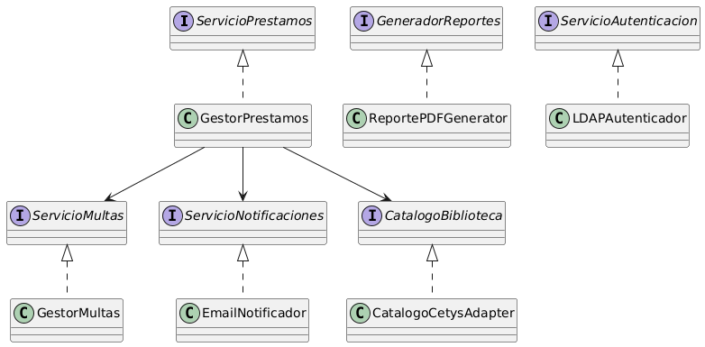

Sección 3:

Pregunta 3A:
GestorBiblioteca viola el Principio de Responsabilidad Única porque hace de todo a la vez, préstamos, multas, emails, PDFs, autenticación y catálogo. Cada una de esas tareas tiene su propia razón para cambiar y no deberían vivir en la misma clase. También viola el Principio Abierto/Cerrado porque cualquier cambio en cualquiera de esas áreas obliga a meterse a modificar la misma clase, no se puede extender sin tocarla. Además de que viola el Principio de Inversión de Dependencias porque al tener métodos como consultarCatalogoCetys() o enviarEmailNotificacion() directamente, está hablando con implementaciones concretas en lugar de depender de abstracciones.
La Dependency Rule dice que las dependencias apuntan hacia el centro, hacia las reglas de negocio. Al separar todo en interfaces, los casos de uso del centro dependen de abstracciones como ServicioNotificaciones o CatalogoBiblioteca, y las implementaciones concretas viven en la capa externa apuntando hacia adentro. Así el dominio queda aislado de los detalles de infraestructura.

Pregunta 3B:
[CatalogoBiblioteca](./Codigos/RepositorioPrestamos.java)
Esta interfaz va en la capa de casos de uso, no en la de infraestructura. El caso de uso es quien necesita persistir préstamos, entonces él define el contrato. La implementación concreta vive afuera y depende de esta interfaz.

[CatalogoBiblioteca](./Codigos/RegistrarPrestamoUseCase.java)
El caso de uso solo conoce la interfaz RepositorioPrestamos, no la implementación. Si se usa MySQL hay una clase RepositorioPrestamosMySQL, y si después se quiere usar MongoDB se crea una RepositorioPrestamosMongo que también implemente la misma interfaz. El use case no se entera del cambio porque sigue hablando con la misma abstracción. El patrón que aparece es el Adapter. La interfaz RepositorioPrestamos define el contrato que espera el caso de uso, y la implementación concreta actúa como un adaptador entre ese contrato y la API real de la base de datos. El use case habla en términos de su propia interfaz y la clase concreta traduce esas llamadas a lo que entiende MySQL o MongoDB.