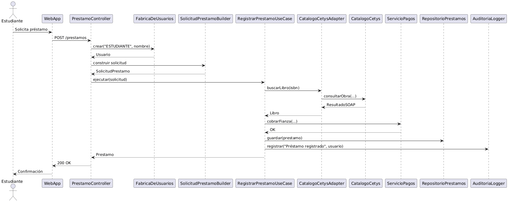

Seccion 4:

Se plantea la siguiente situación: *"Un estudiante solicita un préstamo y el sistema cobra la fianza al Sistema de Pagos Bancario."*

El Factory actúa al inicio del flujo, cuando el controlador necesita un objeto Usuario y le pide a la FabricaDeUsuarios que se lo cree sin saber si es un estudiante, bibliotecario o admin. El Builder entra justo después, cuando se arma la SolicitudPrestamo con los campos obligatorios y opcionales antes de mandarla al caso de uso. El Adapter aparece cuando el caso necesita consultar el libro y llama a CatalogoCetysAdapter, que por dentro traduce la llamada al SOAP de Cetys. El Singleton actúa al final, cuando el caso registra el evento en el AuditoriaLogger, ya que ajá, es la única instancia en el sistema.
La interacción entre el Estudiante y el sistema vive en el nivel 1. La comunicación entre la Web App y el API, y entre el API y los sistemas externos viven en el nivel 2, porque es donde se ven los bloques grandes del sistema y cómo se conectan. Todo lo que pasa dentro del API, las llamadas entre el controller, el use case, la fábrica, el builder, el adapter, el repositorio y el logger, viven en el nivel 3, porque ahí ya nomas vemos las entrañas del contenido de API Backend.
Una decisión que tomé fue cobrar la fianza antes de guardar el préstamo en la base de datos. La razón es que si el cobro falla por cualquier motivo, no quiero que haya un préstamo registrado en la base sin su fianza correspondiente. Si lo hago al revés, tendría que implementar algo para borrar el préstamo cuando falla el pago, lo que podría generar más problemas en sí mismo. Además, el registro de auditoría lo dejé al final porque solo tiene sentido auditar operaciones que efectivamente se completaron.
